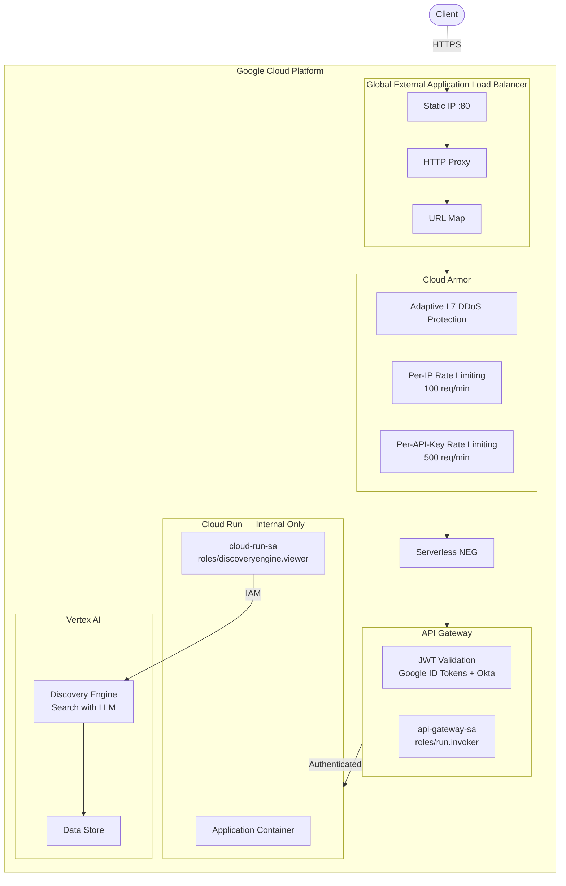

# Example Infrastructure

Terraform configuration for a secure API platform on Google Cloud, serving Vertex AI Discovery Engine (Search) via Cloud Run behind a Global External Application Load Balancer.

## Architecture

## Security

| Requirement | Implementation |
|---|---|
| JWT Authentication | API Gateway validates Google ID tokens and Okta JWTs via OpenAPI security schemes |
| Rate Limiting | Cloud Armor throttle rules — per-IP (100 req/min) and per-API-key header (500 req/min) |
| DDoS Protection | Cloud Armor adaptive L7 DDoS defense |
| Cloud Run Access | Ingress set to `INGRESS_TRAFFIC_INTERNAL_LOAD_BALANCER` — not publicly accessible |
| Vertex AI Search Access | Dedicated Cloud Run service account with `roles/discoveryengine.viewer` via IAM |

## Resources

| File | Resources |
|---|---|
| `main.tf` | Project data source |
| `vertex_ai.tf` | Discovery Engine data store, search engine, datastore locals |
| `cloud_run.tf` | Cloud Run service, service account, Vertex IAM binding |
| `api_gateway.tf` | API Gateway (api, config, gateway), service account, Cloud Run invoker IAM |
| `load_balancer.tf` | Static IP, serverless NEG, backend service, URL map, HTTP proxy, forwarding rule |
| `cloud_armor.tf` | Security policy with DDoS protection and rate limiting rules |
| `apis.tf` | GCP API enablement |
| `variables.tf` | Input variables |
| `outputs.tf` | Gateway URL and load balancer IP |
| `templates/openapi.yaml.tpl` | OpenAPI spec for API Gateway JWT validation and backend routing |

## Variables

| Name | Description | Default |
|---|---|---|
| `project_id` | GCP project ID | — (required) |
| `location` | Discovery Engine location | `eu` |
| `region` | Regional resources (Cloud Run, API Gateway, LB) | `europe-west2` |
| `gateway_url` | API Gateway URL (used as JWT audience) | `https://example-gateway-9am37h3n.nw.gateway.dev` |

## Outputs

| Name | Description |
|---|---|
| `gateway_url` | The `*.gateway.dev` URL of the API Gateway |
| `load_balancer_ip` | Static IP address of the load balancer |
