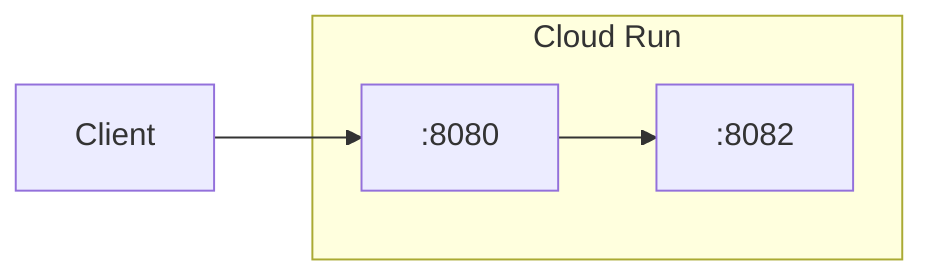

# terraform-gcp-cloud-run-envoy

Terraform module that deploys a [Cloud Run](https://cloud.google.com/run/docs) service with an [Envoy](https://www.envoyproxy.io/docs/envoy/latest/) sidecar proxy handling JWT authentication and RBAC (Role-Based Authorization Control, allowing specific JWT claim checks). The Envoy config is templated per auth provider and stored in a GCS bucket, which the sidecar mounts as a read-only volume.

## Architecture



Envoy acts as the ingress container. It validates JWTs, enforces [RBAC](https://www.envoyproxy.io/docs/envoy/latest/configuration/http/http_filters/rbac_filter) policies, and proxies authenticated requests to the application container over localhost.

## General Configuration

| Variable          | Description                                       | Required | Default | Constraints                                               |
| ----------------- | ------------------------------------------------- | -------- | ------- | --------------------------------------------------------- |
| `project_id`      | GCP project ID                                    | **yes**  | —       | —                                                         |
| `storage_bucket`  | GCS bucket for Envoy configs                      | **yes**  | —       | —                                                         |
| `auth_provider`   | `"google"`, `"okta"`, `"mid"`, or `"mcp-gateway"` | **yes**  | —       | Must be `"google"`, `"okta"`, `"mid"`, or `"mcp-gateway"` |
| `connect_timeout` | Envoy backend connect timeout                     | no       | `"5s"`  | —                                                         |

## Cloud Run Configuration

Passed as a single `cloud_run` object:

| Field                        | Description                                            | Required | Default           | Constraints                                                                                           |
| ---------------------------- | ------------------------------------------------------ | -------- | ----------------- | ----------------------------------------------------------------------------------------------------- |
| `name`                       | Service name                                           | **yes**  | —                 | —                                                                                                     |
| `location`                   | GCP region                                             | **yes**  | —                 | —                                                                                                     |
| `image`                      | Application container image                            | **yes**  | —                 | —                                                                                                     |
| `port`                       | Envoy listener port                                    | no       | `8080`            | —                                                                                                     |
| `backend_port`               | Application container port                             | no       | `8082`            | —                                                                                                     |
| `envs`                       | Environment variables (map)                            | no       | `{}`              | —                                                                                                     |
| `secrets`                    | Secret Manager references (map of `{secret, version}`) | no       | `{}`              | Each entry requires `secret`; `version` defaults to `"latest"`                                        |
| `limits.cpu`                 | CPU limit                                              | no       | `"1000m"`         | —                                                                                                     |
| `limits.memory`              | Memory limit                                           | no       | `"512Mi"`         | —                                                                                                     |
| `scaling.min_instance_count` | Minimum instances                                      | no       | `0`               | —                                                                                                     |
| `scaling.max_instance_count` | Maximum instances                                      | no       | `1`               | —                                                                                                     |
| `service_account`            | Service account email                                  | **yes**  | —                 | —                                                                                                     |
| `ingress`                    | Ingress setting                                        | no       | Auto per provider | `INGRESS_TRAFFIC_ALL` for google, `..._INTERNAL_LOAD_BALANCER` otherwise; `_ALL` blocked for okta/mid |

## Ingress and Authentication

The module ties Cloud Run's ingress setting and IAM policy together based on the auth provider:

**`"google"`** — Ingress defaults to `INGRESS_TRAFFIC_ALL`. Cloud Run enforces IAM authentication (the `Authorization` header is still forwarded to the container). Envoy validates the Google-issued JWT and merges the decoded token claims with any static `google_jwt_payload` claims into the `x-jwt-payload` header.

**`"okta"` / `"mid"` / `"mcp-gateway"`** — Ingress defaults to `INGRESS_TRAFFIC_INTERNAL_LOAD_BALANCER`. Cloud Run grants `allUsers` the invoker role so the `Authorization` header reaches Envoy unmodified for JWT validation. `INGRESS_TRAFFIC_ALL` is **blocked** for these providers — a precondition enforces this at plan time.

## Auth Providers

Set `auth_provider` to one of: `"google"`, `"okta"`, `"mid"`, or `"mcp-gateway"`.

### Google

Intended for lower environments (dev) where Google [IAM](https://cloud.google.com/iam/docs) identity tokens are used. Envoy validates the Google-issued JWT and merges the decoded token claims (email, sub, etc.) with any static `google_jwt_payload` overrides into the `x-jwt-payload` header. This provides a consistent interface with okta/mid providers, so backend code does not need to adapt between environments.

- Ingress defaults to `"INGRESS_TRAFFIC_ALL"` (can be overridden).
- Cloud Run enforces IAM authentication but forwards the `Authorization` header to the container.
- Envoy validates the JWT and merges decoded claims with any static `google_jwt_payload` overrides (static claims take precedence on key conflicts).

```hcl
module "my_service" {
  source         = "./terraform-gcp-cloud-run-envoy"
  project_id     = "my-project"
  storage_bucket = "my-envoy-configs-bucket"
  auth_provider  = "google"

  google_jwt_payload = {
    email = "dev-user@example.com"
    sub   = "12345"
  }

  cloud_run = {
    name            = "my-service"
    location        = "europe-west1"
    image           = "gcr.io/my-project/my-app:latest"
    service_account = "sa@my-project.iam.gserviceaccount.com"
  }
}
```

### Okta

Envoy fetches JWKS from `https://<okta_domain>/oauth2/<okta_auth_server_id>/v1/keys` and validates the Bearer token against the configured issuer and audience.

**RBAC:**

- **Scopes** (`okta_scopes`): When set, an RBAC filter requires **all** listed scopes to be present in the token's `scp` claim. Requests missing any scope receive a `403` with a descriptive error body.
- **Client IDs** (`okta_cids`): When set, an RBAC filter restricts access to tokens whose `cid` claim matches **any** of the allowed client IDs. Use this to limit which Okta applications (machine clients) can call the service.

Cloud Run is set to allow unauthenticated invocations so the `Authorization` header is forwarded intact to Envoy for validation.

```hcl
module "my_service" {
  source         = "./terraform-gcp-cloud-run-envoy"
  project_id     = "my-project"
  storage_bucket = "my-envoy-configs-bucket"
  auth_provider  = "okta"

  okta_domain   = "myorg.okta.com"
  okta_audience = "https://my-api"
  okta_scopes   = ["read:data"]
  okta_cids     = ["0oa1abc2def3ghi4j5k6"]

  cloud_run = {
    name            = "my-service"
    location        = "europe-west1"
    image           = "gcr.io/my-project/my-app:latest"
    service_account = "sa@my-project.iam.gserviceaccount.com"
  }
}
```

### MID (McKinsey ID)

Envoy fetches JWKs from `https://<mid_domain>/auth/realms/r/protocol/openid-connect/certs` and validates the Bearer token.

**RBAC** distinguishes between user tokens and service tokens:

- **User tokens**: Must have an `email` claim present (non-empty) and the `aud` claim must match one of the allowed `mid_stack_ids`.
- **Service tokens**: Must **not** have an `email` claim and the `client_id` claim must match one of the allowed `mid_client_ids`. The `client_id` claim in MID is equivalent to the service account ID.

Valid `mid_domain` values: `"auth.int.mckinsey.id"` (non-prod) or `"auth.mckinsey.id"` (prod).

Cloud Run is set to allow unauthenticated invocations so the `Authorization` header is forwarded intact to Envoy for validation.

```hcl
module "my_service" {
  source         = "./terraform-gcp-cloud-run-envoy"
  project_id     = "my-project"
  storage_bucket = "my-envoy-configs-bucket"
  auth_provider  = "mid"

  mid_domain     = "auth.int.mckinsey.id"
  mid_stack_ids  = ["my-stack-id"]
  mid_client_ids = ["my-service-account-id"]

  cloud_run = {
    name            = "my-service"
    location        = "europe-west1"
    image           = "gcr.io/my-project/my-app:latest"
    service_account = "sa@my-project.iam.gserviceaccount.com"
  }
}
```

### MCP Gateway

Validates JWTs issued by [FastMCP](https://gofastmcp.com/servers/auth/oauth-proxy) using a local JWKS (inline). No RBAC is applied — all requests with a valid JWT are forwarded to the backend with the payload in the `x-jwt-payload` header (base64-encoded).

| Variable                | Description                                    | Required            | Default |
| ----------------------- | ---------------------------------------------- | ------------------- | ------- |
| `mcp_gateway_issuer`    | JWT issuer URL                                 | **yes** (if active) | `""`    |
| `mcp_gateway_audiences` | Expected audiences                             | no                  | `[]`    |
| `mcp_gateway_jwks`      | JWKS JSON string for local validation (inline) | **yes** (if active) | `""`    |

Cloud Run is set to allow unauthenticated invocations so the `Authorization` header is forwarded intact to Envoy for validation.

```hcl
module "my_service" {
  source         = "./terraform-gcp-cloud-run-envoy"
  project_id     = "my-project"
  storage_bucket = "my-envoy-configs-bucket"
  auth_provider  = "mcp-gateway"

  mcp_gateway_issuer    = "https://auth.example.com"
  mcp_gateway_audiences = ["https://my-api.example.com"]
  mcp_gateway_jwks      = jsonencode({ keys = [{ kty = "oct", alg = "HS256", k = "..." }] })

  cloud_run = {
    name            = "my-service"
    location        = "europe-west1"
    image           = "gcr.io/my-project/my-app:latest"
    service_account = "sa@my-project.iam.gserviceaccount.com"
  }
}
```

With a signing key stored in Secret Manager:

```hcl
data "google_secret_manager_secret_version" "jwt_signing_key" {
  secret  = "jwt-signing-key"
  project = "my-project"
}

module "my_service" {
  source         = "./terraform-gcp-cloud-run-envoy"
  project_id     = "my-project"
  storage_bucket = "my-envoy-configs-bucket"
  auth_provider  = "mcp-gateway"

  mcp_gateway_issuer    = "https://auth.example.com"
  mcp_gateway_audiences = ["https://my-api.example.com"]
  mcp_gateway_jwks = jsonencode({
    keys = [{
      kty = "oct"
      alg = "HS256"
      k   = replace(replace(trimright(base64encode(data.google_secret_manager_secret_version.jwt_signing_key.secret_data), "="), "+", "-"), "/", "_")
    }]
  })

  cloud_run = {
    name            = "my-service"
    location        = "europe-west1"
    image           = "gcr.io/my-project/my-app:latest"
    service_account = "sa@my-project.iam.gserviceaccount.com"
  }
}
```

## Logging and Trace Propagation

Envoy emits structured JSON access logs to stdout, formatted to integrate with [Cloud Logging](https://cloud.google.com/logging/docs). Each log entry includes HTTP request details (method, path, status, latency, user agent) and resource metadata.

Trace context is propagated via the [`traceparent`](https://www.w3.org/TR/trace-context/) header (W3C Trace Context format). A Lua filter parses the header (`VERSION-TRACE_ID-SPAN_ID-TRACE_FLAGS`) and sets the following fields in the log entry:

- `logging.googleapis.com/trace` — full trace resource name (`projects/<project>/traces/<trace_id>`)
- `logging.googleapis.com/spanId` — the span ID from the traceparent header
- `logging.googleapis.com/trace_sampled` — whether the trace is sampled (derived from the trace flags)

This allows Cloud Run logs and Envoy access logs to be correlated in [Cloud Trace](https://cloud.google.com/trace/docs).
